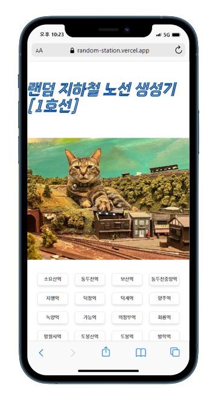

# 랜덤 지하철노선 생성기 🚉

 
 

## 🌠 프로젝트소개

**버튼 클릭 시 호선별로 랜덤한 지하철역이 화면에 나타나는 토이프로젝트**

👉 배포주소 바로가기 : [랜덤 지하철노선 생성기](https://vercel.com/suwan98/random-station)

 
 

## 🔨 기술스택

    

 
 

## 👷 개발기간

**🕑 2023-11-02 ~ 11-04**

 
 

## 🖼️ 구현해야할 기능

1. ~~1호선에서 랜덤하게 하나의 지하철역이 나와야한다 ✅~~
2. ~~범위를 지정할수있어야한다~~
3. ~~사용자가 범위를 정해서 범위 내에서랜덤하게 검색하도록 구현~~
4. 하나의 페이지로 구성하며, UI 및 기능은 유지보수 예정
5. 프레이머 모션으로 애니메이션 기능 구현 필요
6. 공공데이터 가져와서 모든 지하철 노선 렌더링 할 수 있도록 구성하기 [데이터셋 링크](https://data.seoul.go.kr/dataList/OA-15442/S/1/datasetView.do)
